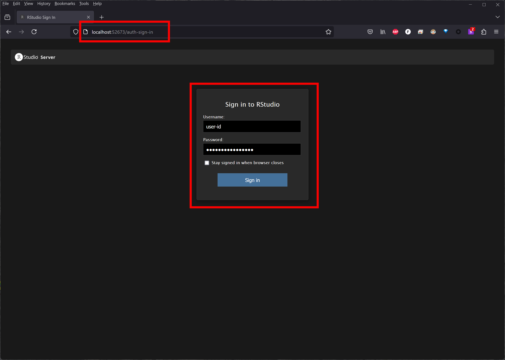
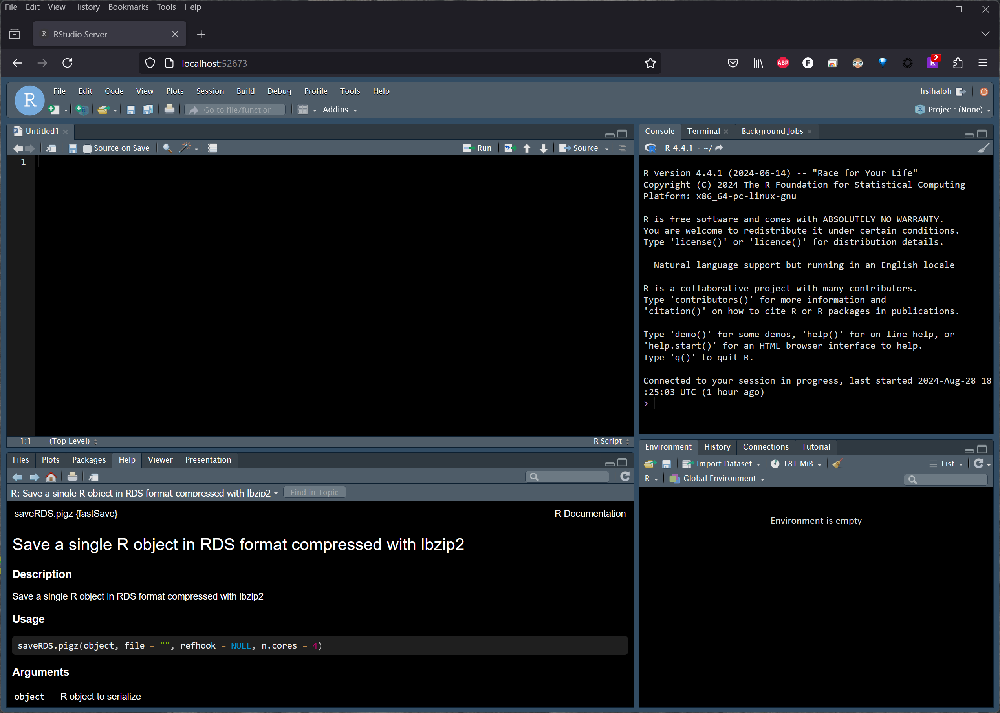

# rstudio_server_hpc
Build a singularity container to run rstudio server on a high performance computing (HPC) cluster

# SIF file
Pre-compiled singularity image file can be dowloaded this [link](https://drive.google.com/file/d/15tTzy15GPCWZFIxqbT3NvQrqk9ai2E-N/view?usp=sharing)

# How to run Rtudio on an HPC cluster
## SSH
Start by login to your HPC cluster by ssh user@domain

```bash
ssh user-id@hpc.domain
# do not run on the head node, you need to have interactive session
interactive -p nocona -c 8
# you need to have singularity software installed on the hpc system

singularity run \
--bind /home/user-id:/mnt/home_hpcc \
--bind /lustre/work/user-id:/mnt/work_hpcc \
./rstudio_server.sif /mnt &

# Example of stdout on the screen ----
# INFO:    Converting SIF file to temporary sandbox...

# RStudio URL:            http://cpu-25-16.localdomain:52673/
# RStudio Username:       user-id
# RStudio Password:       978c319406e40ad1

# You need to open new terminal and ssh user-id@hpc.domain -L 52673:cpu-25-16.localdomain:52673
# Then open in new browser localhost:52673

# You may need to clean your temporary files by yourself:
# RStudio temporary files:        /home/user-id/tmp.vXRaSSze5c

# TTY detected. Printing informational message about logging configuration.
# Logging configuration loaded from '/etc/rstudio/logging.conf'.
# Logging to '/home/user-id/.local/share/rstudio/log/rserver.log'.
# Example of stout on the screen ends ====

# As mention on the stdout you need to open new terminal, ssh with your user id and password
ssh user-id@hpc.domain -L 52673:cpu-25-16.localdomain:52673 # this number will randomly generated according to your node and session

# after you login you need to open new web browser and use the information from the stdout and sign in

```

# New web browser



# Succesful login
Congratulation you run rstudio rserver on an HPC cluster. 
You can now have interactive session with the maximum number cores of a single node of an HPC, and run R parallel.




# How to run Rtudio on a local PC
To run the rstudio server on local PC is similar to an HPC cluster. The only different is you dont need to run ssh.

```bash
singularity run \
--bind /home/user-id:/mnt/home_hpcc \
--bind /lustre/work/user-id:/mnt/work_hpcc \
./rstudio_server.sif /mnt &
```
Open new web browser, paste localhost address from stdout, put information from stdout and sign in 

# Prepare your own SIF file
## Install singularity
Refer to this [link](https://singularity-tutorial.github.io/) how to install singularity and get the source from this [github](https://github.com/sylabs/singularity)


## Build SIF file
Use definition file. singularity build --fakeroot name_container.sif definition_file.def
The launch_rserver.sh and rstudio_auth.sh must be put on working directory you build your image file.

```bash
ls -1
# launch_rserver.sh
# rserver_only.def
# rstudio_auth.sh

singularity build --fakeroot Cent9_rstudio_server.sif rserver_only.def
```


